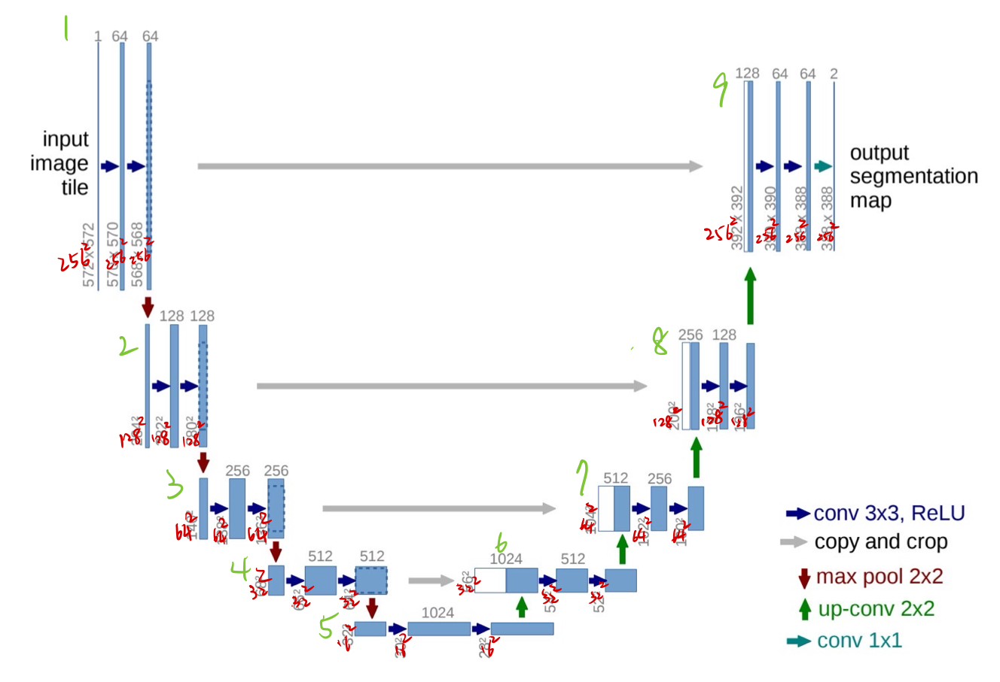
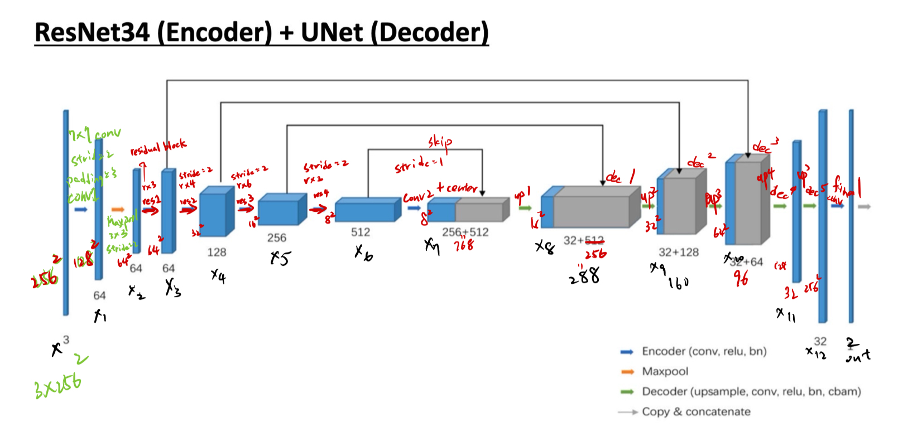
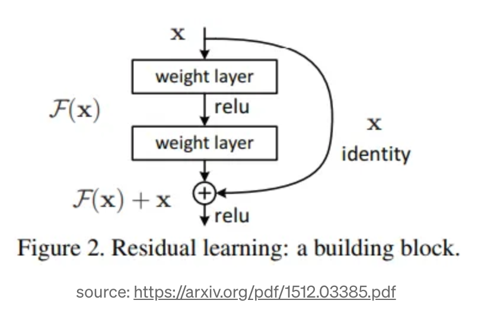
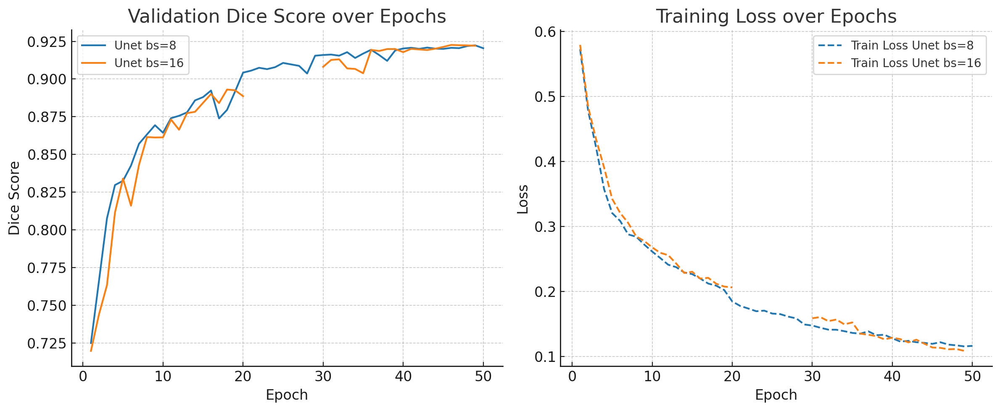

# Experiment Report

NTHU 112065543 Shih Yen Hung

---

## 1. Implementation Details

Two types of model architecture are implemented in this lab: 
(1) U-Net  (2) ResNet34+U-Net

### (1) U-Net

The U-Net adopts a classical encoder-decoder architecture. It constructs multi-scale features through four levels of downsampling (via MaxPooling) and upsampling (via Transposed Convolution). Skip connections are used to concatenate intermediate outputs from the encoder to the corresponding decoder layers, allowing the network to retain spatial and edge information when reconstructing the final segmentation map.

![Architecture diagram from the original U-Net paper [1]](images/image.png)

Architecture diagram from the original U-Net paper [1]

This implementation is primarily based on the architecture proposed in the U-Net paper [1], with some modifications. The implementation code is located in `models/unet.py`. The figure below shows the implemented structure. The green indices correspond to code components in our implementation.



Custom U-Net architecture used in this lab (with code mapping)

- `DoubleConv`：
    
    Both encoder and decoder blocks consist of two consecutive 3×3 convolution layers with ReLU activations (represented as two blue arrows in the architecture). We implemented a `DoubleConv` module to handle these repeated blocks.
    
    In contrast to the original paper, which used "valid" convolution (no padding), we use "same" convolution (padding=1). In the original architecture, due to the absence of padding, each convolution shrinks the feature map. For example, the first conv layer shrinks the input from 572×572 to 570×570. This leads to a mismatch between encoder and decoder feature map sizes, requiring cropping before concatenation.
    
    “The cropping is necessary due to the loss of border pixels in every convolution.” – [1]
    
    Moreover, since the original paper performs tiling-based segmentation, the output size does not necessarily need to match the input size. However, for convenience and consistency in the implementation to ensure that the input and output sizes remain the same. Thus, same padding are applied to avoid cropping and maintain feature alignment across encoder and decoder paths.
    
    
    
    ```python
    class DoubleConv(nn.Module):
      def __init__(self, c_in, c_out):
        super().__init__()
        self.conv1 = nn.Sequential(
            nn.Conv2d(c_in, c_out, kernel_size=3, padding=1), #same convolution
            nn.ReLU()
        )
        self.conv2 = nn.Sequential(
            nn.Conv2d(c_out, c_out, kernel_size=3, padding=1), #same convolution1
            nn.ReLU()
        )
      
      def forward(self, x):
        x = self.conv1(x)
        x = self.conv2(x)
        return x
    ```
    
- Encoder
    
    The encoder consists of 4 downsampling levels. Each level applies a `DoubleConv` block followed by 2×2 max pooling to reduce the spatial dimensions.
    
    ```python
    self.conv1 = DoubleConv(c_in,64)    # (3,256,256) -> (64,256,256)
    self.down1 = nn.MaxPool2d(2)        # (64,256,256) -> (64,128,128)
    
    self.conv2 = DoubleConv(64,128)     # (64,128,128) -> (128,128,128)
    self.down2 = nn.MaxPool2d(2)        # (128,128,128) -> (128,64,64)
    
    self.conv3 = DoubleConv(128,256)    # (128,64,64) -> (256,64,64)
    self.down3 = nn.MaxPool2d(2)        # (256,64,64) -> (256,32,32)
    
    self.conv4 = DoubleConv(256,512)    # (256,32,32) -> (512,32,32)
    self.down4 = nn.MaxPool2d(2)        # (512,32,32) -> (512,16,16)
    ```
    
- Decoder
    
    Each decoder layer first upsamples the feature map using `ConvTranspose2d`, then concatenates it with the corresponding encoder feature map, followed by a `DoubleConv` block for refinement. The `conv5` block acts as the bottleneck layer between encoder and decoder.
    
    ```python
    self.conv5 = DoubleConv(512,1024)    # (512,16,16) -> (1024,16,16)
    self.up1 = nn.ConvTranspose2d(1024, 512, kernel_size=2, stride=2)
    
    self.conv6 = DoubleConv(1024,512)    
    self.up2 = nn.ConvTranspose2d(512, 256, kernel_size=2, stride=2)
    
    self.conv7 = DoubleConv(512,256)    
    self.up3 = nn.ConvTranspose2d(256, 128, kernel_size=2, stride=2)
    
    self.conv8 = DoubleConv(256,128)    
    self.up4 = nn.ConvTranspose2d(128, 64, kernel_size=2, stride=2)
    
    self.conv9 = DoubleConv(128,64)
    ```
    
- Output
    
    Finally, a 1×1 convolution are used  to reduce the output to 2 channels (binary segmentation: foreground vs. background).
    
    ```python
    self.final_conv = nn.Conv2d(64, c_out, kernel_size=1)
    ```
    
- Forward
    
    The forward propagation is defined as follows:
    
    ```python
    def forward(self, x):
        # Down
        x1 = self.conv1(x)
        x2 = self.conv2(self.down1(x1))
        x3 = self.conv3(self.down2(x2))
        x4 = self.conv4(self.down3(x3))
        # Bottleneck
        x5 = self.conv5(self.down4(x4))
        # Up
        x6 = self.conv6(torch.cat([x4, self.up1(x5)], dim=1))
        x7 = self.conv7(torch.cat([x3, self.up2(x6)], dim=1))
        x8 = self.conv8(torch.cat([x2, self.up3(x7)], dim=1))
        x9 = self.conv9(torch.cat([x1, self.up4(x8)], dim=1))
        # Output
        return self.final_conv(x9)
    ```
    

Overall, the implemented U-Net retains the essential characteristics of the original design while adapting padding strategies for ease of implementation and output alignment.

### (2) ResNet34+U-Net

This architecture adopts ResNet34 as the encoder and uses a U-Net-style decoder to recover the spatial resolution of the input.

The design is primarily based on the architecture proposed in [2], with only a few minor adjustments. The implementation can be found in `models/ResNet34_unet.py`. The figure below shows the implemented version, with annotated numbers corresponding to specific components in the source code.



- `ResidualBlock`
    
    The encoder is composed of multiple `ResidualBlock` modules that follow the residual connection structure used in ResNet. Each block performs two 3×3 convolutions, followed by a shortcut (identity) connection. When the stride is greater than 1, a 1×1 convolution is applied to the identity path to match the reduced spatial dimensions. Batch normalization is applied after each convolution layer, as described in the original paper.
    
    
    
    ```python
    class ResidualBlock(nn.Module):
        def __init__(self, c_in, c_out, stride = 1):
            super().__init__()
            self.conv = nn.Sequential(
                nn.Conv2d(c_in, c_out, kernel_size = 3, stride = stride, padding = 1, bias=False),
                nn.BatchNorm2d(c_out),
                nn.ReLU(),
                nn.Conv2d(c_out, c_out, kernel_size = 3, stride = 1, padding = 1, bias=False),
                nn.BatchNorm2d(c_out)
            )
            
            self.identity = nn.Sequential()
            if stride > 1:
                self.identity = nn.Sequential(
                    nn.Conv2d(c_in, c_out, kernel_size = 1, stride = stride, bias=False),
                    nn.BatchNorm2d(c_out)
                )
            
            self.relu = nn.ReLU()
    
        def forward(self, x):
            identity = self.identity(x)      
            x = self.conv(x)
            x = x + identity
            return self.relu(x)
    ```
    
- `CBAM`
    
    According to the architectural diagram in [2], each decoder block incorporates a CBAM (Convolutional Block Attention Module) to enhance attention toward informative features in both the channel and spatial domains. Therefore, CBAM is implemented and applied in the decoder blocks.
    
    .png)
    
    ```python
    class CBAM(nn.Module):
        def __init__(self, c, reduction=16):
            super().__init__()
            # Channel Attention
            self.avg_pool = nn.AdaptiveAvgPool2d(1)
            self.max_pool = nn.AdaptiveMaxPool2d(1)
    
            self.fc = nn.Sequential(
                nn.Conv2d(c, c // reduction, 1, bias=False),
                nn.ReLU(),
                nn.Conv2d(c // reduction, c, 1, bias=False)
            )
    
            # Spatial Attention
            self.spatial = nn.Sequential(
                nn.Conv2d(2, 1, kernel_size=7, padding=3, bias=False),
                nn.Sigmoid()
            )
    
        def forward(self, x):
            # Channel Attention
            avg_out = self.fc(self.avg_pool(x))
            max_out = self.fc(self.max_pool(x))
            ca = torch.sigmoid(avg_out + max_out)
            x = x * ca
    
            # Spatial Attention
            avg_out = torch.mean(x, dim=1, keepdim=True)
            max_out, _ = torch.max(x, dim=1, keepdim=True)
            sa = self.spatial(torch.cat([avg_out, max_out], dim=1))
            x = x * sa
    
            return x
    ```
    
- `DecoderBlock`
    
    The decoder consists of custom `DecoderBlock` modules, which are similar in structure to the `DoubleConv` modules in U-Net, but include Batch Normalization and CBAM, in accordance with the design described in the reference paper.
    
    ```python
    class DecoderBlock(nn.Module):
        def __init__(self, c_in, c_out, use_cbam=True):
            super().__init__()
            self.conv = nn.Sequential(
                nn.Conv2d(c_in, c_out, kernel_size=3, padding=1, bias=False),
                nn.BatchNorm2d(c_out),
                nn.ReLU(),
                nn.Conv2d(c_out, c_out, kernel_size=3, padding=1, bias=False),
                nn.BatchNorm2d(c_out),
                nn.ReLU()
            )
            self.use_cbam = use_cbam
            if self.use_cbam:
                self.cbam = CBAM(c_out)
    
        def forward(self, x):
            x = self.conv(x)
            if self.use_cbam:
                return self.cbam(x)
            else:
                return x
    ```
    
- **Encoder**
    
    The encoder follows the structure of ResNet34. It begins with a 7×7 convolution followed by max pooling, and then proceeds through four stages composed of stacked `ResidualBlock`. The number of output channels in each stage follows the standard ResNet34 progression: 64 → 128 → 256 → 512.
    
    
    
    ```python
    # Encoder ResNet34
    self.conv1 = nn.Sequential(
        nn.Conv2d(c_in, 64, kernel_size=7, stride=2, padding=3, bias=False),
        nn.BatchNorm2d(64),
        nn.ReLU()
    )
    self.maxPool = nn.MaxPool2d(kernel_size=3, stride=2, padding=1)
    
    self.res1 = nn.Sequential(
        ResidualBlock(64,64,1),
        ResidualBlock(64,64,1),
        ResidualBlock(64,64,1)
    )
    
    self.res2 = nn.Sequential(
        ResidualBlock(64,128,2),
        ResidualBlock(128,128,1),
        ResidualBlock(128,128,1),
        ResidualBlock(128,128,1)
    )
    
    self.res3 = nn.Sequential(
        ResidualBlock(128,256,2),
        ResidualBlock(256,256,1),
        ResidualBlock(256,256,1),
        ResidualBlock(256,256,1),
        ResidualBlock(256,256,1),
        ResidualBlock(256,256,1)
    )
    
    self.res4 = nn.Sequential(
        ResidualBlock(256,512,2),
        ResidualBlock(512,512,1),
        ResidualBlock(512,512,1)
    )
    ```
    
- U-net Decoder
    
    The decoder adopts the U-Net approach by upsampling the feature maps and concatenating them with the corresponding encoder outputs. Unlike the original U-Net where the number of feature channels is halved at each step, this implementation uses a fixed size of 32 channels for all decoder outputs, as specified in the referenced paper. A total of five decoding steps are included.
    
    ```python
    self.center = DecoderBlock(768,32,use_cbam)
            
    self.up1 = nn.ConvTranspose2d(32, 32, kernel_size=2, stride=2)
    self.dec1 = DecoderBlock(288,32,use_cbam)
    
    self.up2 = nn.ConvTranspose2d(32, 32, kernel_size=2, stride=2)
    self.dec2 = DecoderBlock(160,32,use_cbam)
    
    self.up3 = nn.ConvTranspose2d(32, 32, kernel_size=2, stride=2)
    self.dec3 = DecoderBlock(96,32,use_cbam)
    
    self.up4 = nn.ConvTranspose2d(32, 32, kernel_size=2, stride=2)
    self.dec4 = DecoderBlock(32,32,use_cbam)
    
    self.up5 = nn.ConvTranspose2d(32, 32, kernel_size=2, stride=2)
    self.dec5 = DecoderBlock(32,32,use_cbam)
    ```
    
- Output
    
    Finally, a 1×1 convolution are used  to reduce the output to 2 channels (binary segmentation: foreground vs. background).
    
    ```python
    self.final_conv = nn.Conv2d(32, c_out, kernel_size=1)
    ```
    
- Forward
    
    The forward propagation is defined as follows:
    
    ```python
    def forward(self, x):
        # Down
        x1 = self.conv1(x)
        x2 = self.maxPool(x1)
        
        x3 = self.res1(x2)
        x4 = self.res2(x3)
        x5 = self.res3(x4)
        x6 = self.res4(x5)
        
        # Bottleneck
        x7 = self.center(torch.cat([self.conv2(x6),x6], dim=1))
    
        # Up
        x8 = self.dec1(torch.cat([self.up1(x7),x5], dim=1))
        x9 = self.dec2(torch.cat([self.up2(x8),x4], dim=1))
        x10 = self.dec3(torch.cat([self.up3(x9),x3], dim=1))
        x11 = self.dec4(self.up4(x10))
        x12 = self.dec5(self.up5(x11))
    
        # Output
        return self.final_conv(x12)
    ```
    

The overall structure closely follows the design in [2]. However, one major difference is that the original paper uses a pretrained ResNet encoder, while in this implementation, the encoder is trained from scratch together with the rest of the network.

### 1.2 Training Pipeline Design

The training pipeline is defined in `train.py`, which is responsible for dataset loading, model training, validation, early stopping, and training history logging.

- **Optimizer**: Adam is used, with the initial learning rate set to `1e-4`.
- **Loss Function**: While the original U-Net paper [1] uses `CrossEntropyLoss`, the ResNet34+U-Net paper [2] applies a combination of `BCELoss` and `DiceLoss`. To ensure fair evaluation between architectures, `CrossEntropyLoss` is consistently adopted for both models, as it is suitable for binary segmentation tasks (foreground vs. background).
- **Epochs**: Due to limited training time, all models are trained for 50 epochs to allow fair comparison under the same conditions.
- **Batch Size**: For U-Net, batch sizes of 8 and 16 are used. For ResNet34+U-Net, batch sizes of 8, 16, and 32 are used.
- **Learning Rate Scheduling**: `ReduceLROnPlateau` is used to halve the learning rate when the validation Dice score does not improve over a certain period.
- **Early Stopping**: Training is terminated if no validation improvement is observed for 5 consecutive epochs.
- **Model Checkpointing**:
    - The best-performing model is saved to `saved_models/{model_type}_bs{batch}_best_model.pth`.
    - Training history, including loss, Dice score, and learning rate, is logged as a JSON file in the `checkpoints/` directory.

During training, `tqdm` is used to display real-time batch loss updates. After each epoch, the average training loss and validation scores are printed.

### 1.3 Evaluation and Inference Design

The evaluation and inference functionalities are implemented in `evaluate.py` and `inference.py`, respectively.

- **`evaluate.py`**:
    - The validation set is evaluated using a `DataLoader`.
    - The average `CrossEntropyLoss` and Dice Similarity Coefficient (Dice Score) are calculated.
    - The model outputs are passed through an `argmax` operation along the channel dimension to obtain class predictions, which are then converted to binary masks for comparison with the ground truth.
- **`inference.py`**:
    - Visualization of results is provided by overlaying predictions and ground truth masks on the original images for up to 10 samples.
    - The average Dice score along with model metadata is logged to `inference_result.csv` for comparison and tracking.
    - When the `-visualize` flag is enabled, the output visualization image is saved to `checkpoints/vis_result_*.png`.

The model architecture (`UNet` or `ResNet34_UNet`) is automatically selected based on the command-line input, which eliminates the need for manual adjustments during inference.

---

## 2. Data Preprocessing

The `load_dataset` function is implemented to verify whether the dataset is already present locally. If not, `OxfordPetDataset.download()` is triggered to automatically download and extract the data. As discussed earlier in the U-Net section, the original paper [1] proposed tiling large images. However, an analysis of image size distribution in the Oxford-IIIT Pet dataset (see figure below) reveals that most images are smaller than 512×512 pixels. To reduce memory overhead and maintain training efficiency, all images are resized to 256×256. The provided `SimpleOxfordPetDataset` class is used, which handles resizing and converts the image format from HWC to CHW.


```python
def load_dataset(data_path, mode, transform=None):
    # IMP
    # if dataset not exist, download the dataset
    if not os.path.exists(os.path.join(data_path, "images")):
        print("Dataset not found, downloading...")
        OxfordPetDataset.download(data_path)
    
    dataset = SimpleOxfordPetDataset(root=data_path, mode=mode, transform=transform)
    return dataset
```

The U-Net paper also mentions the use of data augmentation techniques such as elastic deformation, random rotation and shifting, and brightness/contrast adjustment. Inspired by these, a custom transform class `SegmentationTransform` is defined in `utils.py`. This transformation includes:

- `HorizontalFlip` and `RandomRotate90` for rotation and shifting,
- `GridDistortion` for elastic deformation,
- `RandomBrightnessContrast` for brightness and contrast enhancement.

These transformations are applied during training to increase the model’s generalization ability.

```python
# transform wrapper class
class SegmentationTransform:
    def __init__(self):
        self.transform = A.Compose([
            A.HorizontalFlip(p=0.5),
            A.RandomRotate90(p=0.5),
            A.GridDistortion(p=0.5),
            A.RandomBrightnessContrast(p=0.2),
        ])

    def __call__(self, image, mask, trimap=None):
        augmented = self.transform(image=image, mask=mask) # Only transform
        image = augmented['image']          # [C, H, W]
        mask = augmented['mask']            # [H, W]
        return {"image": image, "mask": mask, "trimap": trimap}
```

---

## 3. Analyze the Experiment Results

(1) U-net



The figure above compares the training dynamics of the U-Net model under different batch sizes (8 and 16). Both settings demonstrate stable convergence in Validation Dice score, ultimately reaching above 0.92. Although the validation Dice score of batch size 16 is missing for epochs 21–29, the trend remains consistent with that of batch size 8.

In terms of training loss, both configurations show similar decline rates, with batch size 8 exhibiting slightly faster initial convergence. These results indicate that both settings are effective, but batch size 8 may provide a smoother learning curve in earlier stages.


To evaluate the model's generalization ability on unseen data, inference was conducted on the test set using `inference.py`. The resulting Dice scores range from **0.9226 to 0.9242**, indicating strong segmentation performance.

The figure above visualizes the first 10 test samples. The green regions represent the ground truth, while the red regions indicate the model's predictions.

In relatively simple backgrounds (e.g., Sample 5, 8, and 10), the model is able to accurately distinguish the foreground. However, in cases with more complex backgrounds or unusual poses (e.g., Sample 1, 4, and 6), deviations at the object boundaries can be observed. Thin structures such as tails (e.g., Sample 3 and 9) are also more challenging to predict precisely.

Overall, the predictions meet expectations, demonstrating that the model generalizes well to new data.

(2) ResNet34 + U-net


As shown in the figure above, all batch sizes demonstrate a steady increase in Dice score throughout training. Among them, batch size 16 achieved the highest final Dice score (~0.924), while batch size 32 exhibited slightly more fluctuation in validation loss and the lowest final Dice score (~0.919).

Although batch size 8 converged faster initially and produced smooth training/validation loss curves, its final performance was marginally below that of batch size 16. This suggests that a moderate batch size strikes a good balance between gradient stability and generalization.


Inference was performed on the test set using `inference.py`. The ResNet34+U-Net model achieved Dice scores ranging from **0.9245 to 0.9275**, slightly outperforming the original U-Net. This suggests that incorporating residual connections and attention mechanisms contributes positively to the model's generalization capability.

As shown in the figure above, green areas represent the ground truth masks, while red areas indicate the predicted results. Most samples (e.g., Sample 2, 5, 7, and 8) show accurate foreground segmentation with well-aligned boundaries. Although thin structures such as tails (e.g., Sample 3 and 9) remain difficult to segment precisely, the performance is slightly better than that of the plain U-Net.

Some misclassifications still occur in challenging scenes, such as those with complex backgrounds (e.g., Sample 1 and 4) or extreme lighting conditions (e.g., Sample 6 and 10). Nevertheless, the model demonstrates stable and reliable semantic segmentation performance and is capable of handling a diverse range of input conditions.

(3) U-net vs. ResNet34+U-Net

.png)

The figure above compares the training dynamics of UNet and ResNet34+UNet under the same batch size of 8. In terms of validation performance (left plot), the ResNet34+UNet model demonstrates a slightly faster improvement in Dice score during the early epochs and maintains a marginal lead throughout training. Both models ultimately reach a Dice score above 0.922, with ResNet34+UNet achieving a slightly higher peak.

As for training loss (right plot), both models exhibit stable convergence, but ResNet34+UNet starts with a lower loss and maintains a more consistent downward trend. This suggests that the residual connections in the encoder facilitate more efficient feature learning and gradient flow during training.

These results indicate that incorporating residual features provides measurable benefits in both training efficiency and final segmentation accuracy, even when the batch size is kept small.

Initially, it was assumed that the ResNet34+U-Net architecture would outperform the vanilla U-Net in terms of Dice score. However, after training and evaluation, the results showed that the performance difference between the two models on the test set was not significant.

However, the major distinction was observed during training: ResNet34+U-Net trained approximately twice as fast as U-Net. 


U-net summary 


ResNet34+U-net summary

Interestingly, despite having fewer parameters and a smaller model size, ResNet34+U-Net achieved comparable or slightly higher Dice scores than U-Net. These findings suggest that ResNet34+U-Net is more computationally efficient while maintaining similar segmentation performance, making it a more practical choice for this task.

---

## 4. Execution Steps

- **Set up the environment**
    
    Navigate to the project root directory and install the required dependencies using the provided `requirements.txt`:
    
    ```bash
    pip install -r requirements.txt
    ```
    
- Train a Model
    
    The training process is executed using the `src/train.py` script.
    
    Example:
    
    ```bash
    python src/train.py \
    --data_path dataset/oxford-iiit-pet \
    --model_type Resnet34_Unet \
    --epochs 50 \
    --batch_size 8 \
    --learning-rate 1e-4
    ```
    
    **Arguments:**
    
    | Argument | Description |
    | --- | --- |
    | `--data_path` | Path of the input data
    (default='dataset/oxford-iiit-pet’) |
    | `--model_type` | Specify the model type: `Unet` or `ResNet34_Unet`. |
    | `--epochs` | Number of training epochs. |
    | `--batch_size`
    `-b` | Batch size for training. Common values: 8, 16, 32.
    (default=4) |
    | `—learning-rate`
    `-lr` | Initial learning rate (default: `1e-4`). |
    | `--no_cbam` | (Optional) Disable CBAM in `ResNet34_Unet`decoder blocks |
- Run Inference on Test Set
    
    Use the `src/inference.py` script to perform inference and optionally visualize results
    
    Example:
    
    ```bash
    python src/inference.py \
    --data_path dataset/oxford-iiit-pet \
    --model saved_models/ResNet34_Unet_bs8_best_model.pth \
    --model_type ResNet34_Unet
    ```
    
    **Arguments:**
    
    | Argument | Description |
    | --- | --- |
    | `--data_path` | (Optional) Path of the input data
    (default='dataset/oxford-iiit-pet’) |
    | `--model` | Path to the `.pth` model file. |
    | `--model_type` | Model type: `Unet` or `ResNet34_Unet`. |
    | `--batch_size`
    `-b` | Batch size for testing. 
    (default=4) |
    | `--visualize` | (Optional) If set, shows and saves visual comparison images of predictions vs. GT. |
    | `--no_cbam` | (Optional) Disable CBAM in `ResNet34_Unet`decoder blocks |
    
    Results such as average Dice score and model metadata are saved to `checkpoints/inference_result.csv`. Visualization samples (if enabled) are saved as `checkpoints/vis_result_*.png`.
    

---

## 5. Discussion

One promising direction for improving segmentation performance is the application of **transfer learning**. As discussed in Section 1, the original ResNet34+UNet architecture proposed in [2] leverages a pretrained ResNet34 as the encoder. In this project, the encoder was trained from scratch, which may limit its ability to extract robust features, especially given the relatively small dataset. Incorporating a ResNet34 encoder pretrained on a large-scale dataset such as ImageNet could provide better feature representations from the beginning of training and accelerate convergence, potentially leading to higher segmentation accuracy.

Another aspect worth exploring is the **loss function design**. While this project adopts `CrossEntropyLoss` for consistency across models, [2] reports improved results using a combination of **Binary Cross-Entropy (BCE) Loss and Dice Loss**. The BCE loss provides pixel-level classification guidance, while Dice loss directly optimizes the overlap between the predicted and ground truth masks. Combining both can encourage more balanced optimization, especially in datasets with class imbalance (e.g., small foreground objects compared to the background).

In terms of model architecture, the following alternatives are worth consideration:

- **DeepLabV3+**: This model utilizes atrous spatial pyramid pooling (ASPP) and an encoder-decoder structure, enabling it to capture multi-scale context effectively. It is particularly strong in capturing long-range dependencies and is known for its performance on various segmentation benchmarks.
- **HRNet (High-Resolution Network)**: Unlike conventional encoder-decoder models that downsample and upsample, HRNet maintains high-resolution representations throughout the network. This design allows better localization and finer boundary prediction, which could be beneficial for segmenting detailed structures such as the tails and ears in pet images.

Additionally, improvements may be achieved by applying **advanced data augmentation strategies**. The current implementation includes basic spatial and brightness transformations, elastic deformation ****but further enhancement could be made by incorporating **random occlusions**, or **mixup/cutmix for segmentation**.

---

Reference:

[1] **U-Net: Convolutional Networks for Biomedical Image Segmentation**

[https://arxiv.org/abs/1512.03385](https://arxiv.org/abs/1505.04597v1)

[2] **Deep learning-based pelvic levator hiatus segmentation from ultrasound images**

[https://www.researchgate.net/publication/359463249_Deep_learning-based_pelvic_levator_hiatus_segmentation_from_ultrasound_images](https://www.researchgate.net/publication/359463249_Deep_learning-based_pelvic_levator_hiatus_segmentation_from_ultrasound_images)
